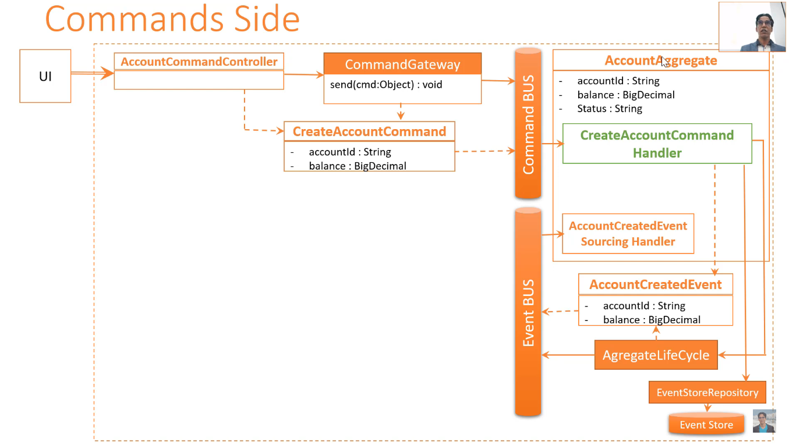
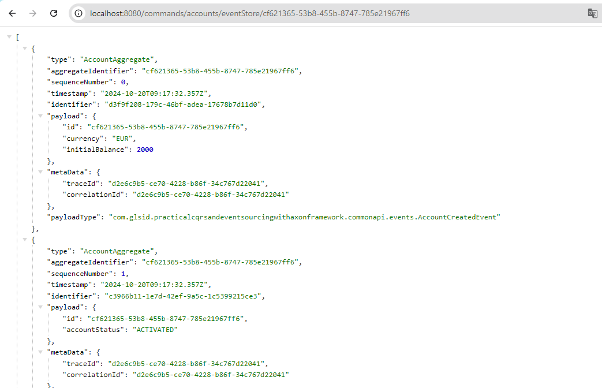
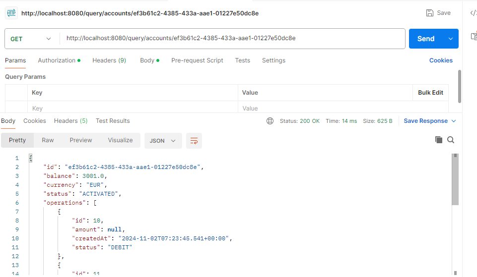

# CQRS and Event Sourcing Concept Notes

## Key Definitions

### CQRS (Command Query Responsibility Segregation)
- A pattern that separates read and write operations in an application
- Commands: modify state (write operations)
- Queries: retrieve state (read operations)

### Event Sourcing
- A pattern where the state of the application is stored as a sequence of events
- Instead of storing current state, all changes are recorded as events

### Commands
- Represent intentions to change the system state
- Immutable objects (only getters, no setters)
    - Why? To ensure consistency and prevent unintended modifications after creation
- Typically contain:
    - An identifier for the target aggregate
    - Necessary data for the operation

### Events
- Represent facts that have occurred in the system
- Also immutable
- Describe what has happened, not what should happen

### Aggregate
- An Aggregate in Event Sourcing is a cluster of domain objects that can be treated as a single unit. 
- The state of an Aggregate is not stored in a traditional database record but is reconstructed from a sequence of events. 
- These events represent all the changes that have occurred to the Aggregate over time. 
- The Event Sourcing engine replays these events to rebuild the current state of the Aggregate. 
- **Aggregates handle commands, emit events when their state changes**, and update the read model, which is optimized for querying. 
- This separation of command and query responsibilities is a key aspect of the CQRS (Command Query Responsibility Segregation) pattern.

### Event Store
- Database that stores the sequence of events
- Used to reconstruct the current state of the system

### Event Bus
- Middleware that routes events to appropriate handlers
- Facilitates communication between different parts of the system

### Axon Framework
- A Java framework that simplifies the implementation of CQRS and Event Sourcing
- Provides the necessary infrastructure (command bus, event bus, etc.)

## Implementation Concepts

### @TargetAggregateIdentifier
- Annotation used in commands to specify which aggregate instance should handle the command

### DTOs (Data Transfer Objects)
- Objects used to carry data between processes
- In CQRS, often used to structure incoming command data or outgoing query results

### Command Handlers (function de décision)
- Methods that process specific commands
- Validate the command and produce events

### Event Handlers(function d'évolution)
- Methods that react to specific events
- Update the read model or trigger side effects

### Projections
- Process events to build and maintain read models
- Optimize data for querying

## Command Handling Process

When the system receives a command, it goes through several stages of processing.
This process ensures that commands are properly validated, executed,
and their effects are correctly applied to the system state.
Here's a detailed breakdown of the steps:

1. **Command Reception**
    - The API endpoint (usually a REST controller) receives the command as a request.
    - The controller creates a command object from the request data.

2. **Command Dispatch**
    - The controller uses the `CommandGateway` to send the command to the command bus.
    - The `CommandGateway` abstracts the complexity of interacting with the command bus.

3. **Command Routing**
    - The command bus routes the command to the appropriate command handler.
    - This routing is typically based on the command's type and the `@TargetAggregateIdentifier`.

4. **Command Handling**
    - The `@CommandHandler` method in the aggregate receives the command.
    - It performs validation to ensure the command can be executed in the current state.
    - If valid, it creates one or more domain events representing the changes.

5. **Event Publication**
    - The command handler publishes the created events to the event bus.
    - This is typically done using the `AggregateLifecycle.apply()` method in Axon.

6. **Event Sourcing**
    - The `@EventSourcingHandler` methods in the aggregate listen for these events.
    - When an event is received, it updates the aggregate's state.
    - This ensures that the aggregate's state is always derived from its event history.

7. **Event Storage**
    - The event store persists the new events, maintaining the event stream for the aggregate.

8. **Read Model Update**
    - Event handlers or projections listen to the event bus and update the read model as necessary.
    - This step may happen asynchronously, leading to eventual consistency.

9. **Command Response**
    - The command's result (success or failure) is returned to the `CommandGateway`.
    - The gateway then provides this result back to the controller.

10. **API Response**
    - The controller formulates and sends an appropriate response to the client.

This process ensures a clear separation between command processing (which may change the system state) 
and query processing (which only reads the state). It also provides a robust audit trail through the stored events,
allowing for powerful debugging, auditing, and state reconstruction capabilities.



## Best Practices

1. Separate command and query models
    - Why? Allows for independent scaling and optimization

2. Use immutable objects for commands and events
    - Why? Ensures data integrity and simplifies reasoning about the system

3. Design fine-grained, descriptive events
    - Why? Provides a clear audit trail and enables detailed event replay

4. Consider using Kotlin for DTOs, commands, and events
    - Why? More concise syntax, null safety, and immutability by default

5. Keep core domain logic in the command handling side
    - Why? Maintains a single source of truth for business rules

## Advantages of CQRS and Event Sourcing

1. Scalability: Read and write sides can be scaled independently
2. Flexibility: Easy to add new read models or change existing ones
3. Audit trail: Complete history of all changes
4. Time travel: Ability to reconstruct past states

## Challenges

1. Increased complexity compared to traditional CRUD systems
2. Eventual consistency between command and query sides
3. Learning curve for developers new to these patterns

## endpoints to test the application
1. **Create a new bank account**
    - POST http://localhost:8080/commands/accounts/create
    - Request Body:
    ```json
    {
    "initialBalance": 2000,
    "currency": "EUR"
   }
    ```
2. **Retrieve events for a specific account**
    - GET http://localhost:8080/commands/accounts/eventStore/{accountId}
    - Replace `{accountId}` with the actual account ID


3. **Retrieve specific account details**
    - GET http://localhost:8080/query/accounts/ef3b61c2-4385-433a-aae1-01227e50dc8e
    - Replace `ef3b61c2-4385-433a-aae1-01227e50dc8e` with the actual account ID

